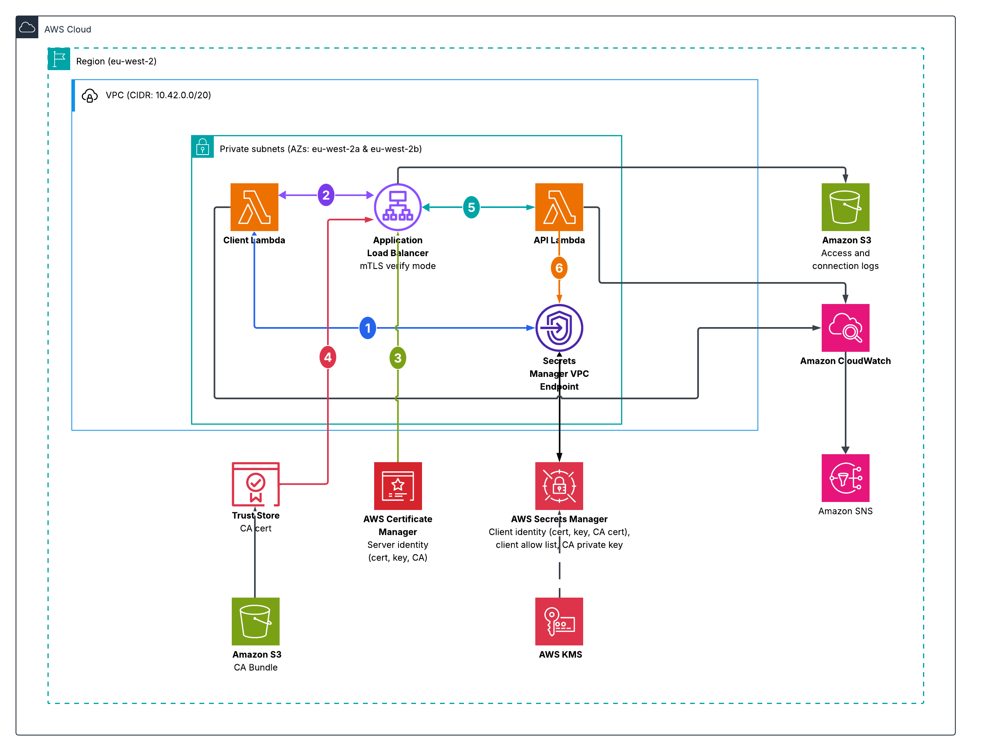

# Internal mTLS API on AWS

An internal API for other services in the same VPC to call, authenticated with
mutual TLS. It has no route to or from the internet, refuses any caller that
cannot present a certificate signed by its own certificate authority, logs every
request and every handshake for audit, and alarms on server errors.

## Contents

- [Architecture](#architecture)
- [Design choices](#design-choices)
- [Assumptions](#assumptions)
- [Gaps and follow-ups](#gaps-and-follow-ups)
- [Deploy, verify, tear down](#deploy-verify-tear-down)
- [CI/CD](#cicd)
- [AI usage and critique](#ai-usage-and-critique)
- [Stretch goals](#stretch-goals)

## Architecture

### What was built

**Networking.** One VPC in `eu-west-2` on `10.42.0.0/20`, with two private
subnets: `10.42.0.0/24` in `eu-west-2a` and `10.42.1.0/24` in `eu-west-2b`. No
internet gateway, no NAT, and a route table with no default route. One interface
endpoint for Secrets Manager, with a network interface in each subnet. The
default network ACL is left in place.

**Compute.** Two Python 3.13 functions on arm64, both attached to the private
subnets. One serves the API. One is a test client that holds a certificate and
calls the API.

**API layer.** An internal Application Load Balancer with an HTTPS listener on
port 443 in mutual TLS verify mode, using the
`ELBSecurityPolicy-TLS13-1-2-2021-06` policy, with the API function as its
target. The API is served at `api.internal.cpe`, a record in a private hosted
zone.

**Certificates.** A self-signed certificate authority, generated by Terraform's
`tls` provider, signs two certificates. The server certificate is imported into
ACM for the listener to present. The client certificate is stored in Secrets
Manager. The CA certificate is published to S3 and loaded into the load
balancer's trust store.

**Observability.** Load balancer access and connection logs to S3, function logs
to CloudWatch, VPC flow logs, Route 53 resolver query logs, and an alarm on
server errors from the target. One customer managed key encrypts the secrets,
the log groups and the artefacts bucket.



### How a request works

**1. The client loads its certificate.** Through the VPC endpoint it reads a
single secret that holds three things: its certificate, its private key, and the
CA certificate. Only the certificate is ever transmitted. The key stays in the
function and is used to sign a value proving the certificate belongs to it, and
the CA certificate is what it checks the load balancer against at step 3. This
happens once per execution environment, not on every request.

**2. It resolves the name and connects.** `api.internal.cpe` resolves through the
private hosted zone to an address inside the VPC, and the client opens a
connection on port 443. The name requested here is the name that has to appear
in the certificate at the next step.

**3. The load balancer proves who it is, first.** TLS works this way round: the
server presents its certificate before asking the client for one. The client
checks that the CA signed it, that it is in date, and that the hostname it asked
for appears in it. If any check fails the client stops here and never sends its
own certificate.

**4. Then the client proves who it is.** It presents its certificate and signs a
value with its private key, which is never transmitted. The load balancer
validates that certificate against the trust store, and anything signed by a
different authority is refused during the handshake, before a request exists.
That refusal appears in the connection log and nowhere else.

**5. The load balancer invokes the function.** This is an AWS API call rather
than a network connection, so the function listens on no port and the load
balancer needs no outbound rule. It passes the certificate subject it has just
verified in a request header.

**6. The function decides whether to serve the caller.** A valid certificate
proves the CA signed it, not that the holder is still permitted. The function
reads an allow list from Secrets Manager and compares the verified subject
against it, returning 403 if the name is not there.

The response returns over the same connection, carrying the caller's name taken
from its certificate. A 200 shows the path works. That name shows the identity
survived every stage of it.

### Trust boundaries

Three checks stand between a caller and a response, and a fourth boundary
limits what a compromised function could reach. They hold independently of each
other: if the CA private key leaked, a forged certificate would satisfy the
load balancer and still be refused by the API function's allow list.

| Boundary | The concern | How it is addressed |
|---|---|---|
| **The VPC** | Anything on the internet reaching an internal service | No internet gateway, no NAT, and the hostname does not resolve in public DNS |
| **The load balancer** | A workload inside the VPC impersonating a permitted caller | A certificate our CA did not sign is refused during the handshake, before a request exists |
| **The API function** | A certificate that is still valid but belongs to a caller that should no longer be served | The verified name is checked against an allow list held outside the deployment package |
| **IAM** | A compromised function reaching key material it has no need for | Each role names a single secret: the API function reads the allow list, the client reads its own identity. Neither can read the CA private key, which nothing reads |

### Network access

Five security groups. Each path needs a rule at both ends, one letting the
caller out and one letting it in.

| Security group | Inbound | Outbound | Why |
|---|---|---|---|
| Load balancer | 443 from the VPC range | Nothing | Inbound so any service in the VPC can call the API. No outbound needed, because a Lambda target is invoked through AWS rather than connected to over the network |
| API function | Nothing | 443 to the Secrets Manager endpoint | No inbound needed, because the load balancer invokes it through AWS rather than opening a connection to it. Outbound to read the allow list of permitted client names from Secrets Manager |
| Test client | Nothing | 443 to the Secrets Manager endpoint and to the load balancer | No inbound needed, because it is invoked directly rather than called over the network. Outbound to read its certificate from Secrets Manager and then call the API |
| Secrets Manager endpoint | 443 from the API function and the test client | Nothing | Inbound from each workload that needs it, added by that workload. No outbound needed, because it only receives connections and the reply travels back on the one already open |
| VPC default | Nothing | Nothing | Neither needed. Adopted and emptied so nothing can attach to it and inherit access by accident |

No group has a rule for DNS. Name lookups go to the VPC resolver, which security
groups cannot filter, so no rule is needed or possible.

### Permissions

Three roles, each assumed by a service.

| Role | Assumed by | May do |
|---|---|---|
| API function | Lambda | Read the `cpe-dev/allowed-clients` secret, decrypt it with the project key, and manage its own network interfaces |
| Test client | Lambda | Read the `cpe-dev/client-identity` secret, decrypt it with the project key, and manage its own network interfaces |
| Flow log | VPC Flow Logs | Write to the `/aws/vpc/cpe-dev` log group |

Both functions run inside the VPC, so Lambda creates a network interface for
each one and deletes it later. Those EC2 permissions come from the AWS managed
policy built for this, rather than a hand written copy, because they cannot be
narrowed to specific subnets. Writing them out would grant exactly the same
access and leave us maintaining it.

### Terraform project structure

There are two places Terraform runs, and only one of them builds the API.

`environments/dev` is the entry point. It holds no resources of its own, only
calls to the four modules and the values they need, and applying it creates
everything described above. A second environment would be another directory
beside it, calling the same modules with different values.

`bootstrap` is the other root. It is applied once per account, holds only the
identity CI needs, and can otherwise be ignored, since nothing that serves the
API depends on it.

| Module | Owns |
|---|---|
| `network` | The VPC, two private subnets and their route table, the Secrets Manager endpoint and its security group, the private DNS zone, flow logs and resolver query logs |
| `certificates` | The certificate authority and the two certificates it signs, the ACM import, the bucket holding the CA certificate, the trust store, the secrets and the KMS key |
| `api` | The load balancer and its mutual TLS listener, the target group, the API function and its role, the allow list, the access log bucket, the DNS record and the error alarm |
| `test_client` | A function inside the VPC that holds a certificate and calls the API, with its own role and security group. Verification only, not part of the deployed service |

## Design choices

| Decision | Chosen | Rejected | Why |
|---|---|---|---|
| API layer | Internal Application Load Balancer | API Gateway | The API has to be reachable only from inside the VPC, which means a private API, and [mutual TLS is not supported on private APIs](https://docs.aws.amazon.com/apigateway/latest/developerguide/rest-api-mutual-tls.html). It needs a regional custom domain, which is public. An internal ALB does both |
| mTLS mode | `verify` | `passthrough` | In verify mode the load balancer validates the certificate against the trust store and refuses a bad one during the handshake, before a request exists. Passthrough forwards the chain unchecked and leaves the validation to application code, which is security critical and easy to get wrong |
| Certificate authority | Self-signed, generated by Terraform's `tls` provider | AWS Private CA | AWS Private CA is [$400 per CA per month](https://aws.amazon.com/private-ca/pricing/), or $50 in short-lived certificate mode, billed whether or not it issues anything. The `tls` provider costs nothing, generating the key and signing locally during the apply. Here a self-signed CA issues exactly two certificates, one for the load balancer to present and one for the client to present. This suits a dev environment being tested and torn down, not production: the trade-off is that the private keys end up in Terraform state, which is gap 1. A CA that is not self-signed would also let ACM renew the load balancer's certificate automatically, which nothing generated this way can do |
| Secret storage | Secrets Manager | SSM Parameter Store | There is no NAT or internet gateway, so a function reaching any AWS service needs an interface endpoint inside the VPC. Either choice costs one endpoint at around $16 a month, so the network cost is identical and does not decide it. Parameter Store is cheaper to store in. Its free standard tier [caps a value at 4 KB](https://docs.aws.amazon.com/systems-manager/latest/userguide/parameter-store-advanced-parameters.html), which covers two of the three secrets, and the client bundle is about 5 KB so it would sit on the billed advanced tier. That comes to $0.05 a month for all three, against [$0.40 per secret](https://aws.amazon.com/secrets-manager/pricing/) in Secrets Manager, $1.20 in total. The extra dollar buys a policy on the secret that can deny access IAM allows, a deletion recovery window set to zero here so the environment can be rebuilt under the same names, and rotation. Parameter Store has none of them. The CA and both leaf certificates expire 30 days after apply, so rotation is the useful one, though nothing rotates here, which is gap 3 |
| CA scope | One CA for both sides | A separate CA for the server and for the client | One CA signs both certificates. The load balancer trusts it, so it accepts the client; the client trusts it, so it accepts the load balancer. Two CAs would keep the sides apart, so a compromise of one could not produce a certificate for the other. That matters at scale, not at two certificates in one dev environment, where it only adds a second key to generate, store and rotate. Each certificate is also marked for its own role, server or client, though AWS does not document the load balancer checking that, so it is treated as a bonus rather than a control |
| Target group health checks | None | Enabling them | [Health checks are disabled by default](https://docs.aws.amazon.com/elasticloadbalancing/latest/application/lambda-functions.html#enable-health-checks-lambda) on a Lambda target group, and declaring the block at all makes Terraform send HTTP settings the target group rejects, so the apply fails. Turning them on would be wrong anyway. A probe arrives carrying only a `user-agent` header, so the function sees no client certificate and refuses it. The target would be marked unhealthy, every probe would log a refusal, and each one is a billed invocation |
| Network ACLs | Default left in place | A custom ACL per subnet | There is no internet gateway and no NAT, so nothing can leave the VPC whatever the rules say. Inside it, security groups already control every path and refer to each other by ID, while a network ACL only understands address ranges. It is also [stateless](https://docs.aws.amazon.com/vpc/latest/userguide/vpc-network-acls.html): allowing a call out to 443 means allowing the reply back on ports 1024 to 65535, so most of the port range ends up open. A network ACL is worth having when you need to deny something, because security groups can only allow |
| S3 gateway endpoint | Not created | Creating one | A private VPC that uses S3 would normally have one, so the absence is deliberate rather than an oversight. Two buckets exist, one holding the CA bundle for the trust store and one holding load balancer logs, but neither is reached from inside the VPC. Elastic Load Balancing reads and writes them as a service, and both functions only call Secrets Manager. A gateway endpoint is [free](https://docs.aws.amazon.com/vpc/latest/privatelink/gateway-endpoints.html), so cost is not the reason. It would add a route to every route table that nothing would ever use |

## Assumptions

**1. One AWS account.** Nothing here is shared with another account or another
environment, which is why one KMS key and identity-based access control cover
it. Separate accounts would need a key policy and a policy on each secret.

**2. No existing corporate PKI.** There is no authority to issue from, so the
CA is created here. An organisation with its own would issue both certificates
from it, and the trust store would carry its root.

**3. Every caller is inside this VPC.** No on-premises network, no peered VPC,
no human caller. A private hosted zone and a CA that only these workloads trust
therefore do the job. Anything calling from outside would need the zone shared
and routing added.

**4. Requests and responses stay under 1 MB.** That is the [limit for a Lambda
target](https://docs.aws.amazon.com/elasticloadbalancing/latest/application/lambda-functions.html).
Past it, the load balancer would have to point at containers or instances
instead.

## Gaps and follow-ups

**1. Every private key is in Terraform state.**

The `tls` provider generates three keys during the apply, one for the CA and
one for each certificate it signs, and all three are written to state in
plaintext. No remote backend is configured, so that state is a file on disk
beside the configuration, on whichever machine ran the apply. It is gitignored
and has never been committed. That is acceptable only for a test environment
that is rebuilt every day and thrown away. It would not be acceptable anywhere
that runs for longer than that.

**Follow-up.** Create a state bucket in bootstrap with versioning and
encryption enabled, then uncomment the backend block, which already sets
`encrypt` and native locking. HCP Terraform is the other option and gives
remote state, locking and run history without a bucket to create and maintain,
and is [free below 500 managed
resources](https://developer.hashicorp.com/terraform/cloud-docs/overview),
which this is well under. Its state is encrypted at rest and access-controlled,
but it lives on HashiCorp's infrastructure rather than in an account you
control, and that file holds three private keys. That is the reason to prefer
S3 here.

**2. Certificates are issued by Terraform, not by a managed CA.**

The `tls` provider creates the authority and signs both leaf certificates
during the apply. The CA is therefore self-signed, nothing protects the signing
key beyond the file it sits in, and issuing a certificate leaves no record
anywhere. There is no policy on what may be issued either: another certificate
is another resource block.

**Follow-up.** AWS Private CA is the managed equivalent, at [$400 per CA per
month or $50 in short-lived certificate
mode](https://aws.amazon.com/private-ca/pricing/). Certificates are charged on
top, except that a certificate whose key you cannot reach is free, which covers
the one the load balancer uses, so only the client's would be billed. The
service creates the signing key and never returns it, so it cannot reach state,
calls to the CA are captured in CloudTrail, and a certificate requested through
ACM has its key generated by ACM. The client is different, because it has to
hold its own key in order to present a certificate. AWS documents the pattern:
the client [generates its key and a signing request
locally](https://docs.aws.amazon.com/privateca/latest/userguide/PcaIssueCert.html)
and sends only the request to be signed, so the key never leaves. A certificate
issued that way is unmanaged, and nothing renews it. Requesting it through ACM
instead means ACM generates the key and you export it, so the key travels, and
every renewal has to be exported and delivered again. Neither path avoids
handling the key yourself.

**3. Nothing renews the certificates.**

Validity is set to 720 hours, so the CA and the two certificates it signed all
expire 30 days after the apply that created them. When that happens the client
checks the load balancer's expiry date, fails, and stops before sending its own
certificate. No request is ever made, so nothing appears in the API's log group
and the failure shows up only in the client's logs and the load balancer's
connection log. Replacing a single certificate would not help, because the CA
that signed it has expired as well. ACM does not renew any of it, since
imported certificates are not eligible for managed renewal.

**Follow-up.** Today the answer is to run `terraform apply` again, which
regenerates all three. In production, Secrets Manager rotation would call a
function on a schedule to issue a replacement, update the secret and reimport
to ACM before expiry. The only cost is the rotation function's own invocations.

**4. A certificate cannot be withdrawn before it expires.**

If the client's private key leaked tomorrow, nothing would stop that
certificate being accepted for the rest of its 30 days. The trust store holds
the CA and accepts anything the CA signed, and no certificate revocation list
is configured. The allow list covers part of this, since the function checks
the verified subject against it and a client can be dropped there without
touching any certificate. That happens after the handshake rather than during
it, so a withdrawn client still completes a TLS connection and still invokes
the function before it is refused.

**Follow-up.** Attach a certificate revocation list to the trust store. That is
the list of certificates the CA has declared invalid ahead of their expiry, and
it lets the listener refuse a withdrawn one during the handshake. The list is
held in S3, so the cost is storage alone.

## Deploy, verify, tear down

### Prerequisites

Terraform `~> 1.16`, the AWS CLI, and credentials for a single AWS account.
Everything is created in `eu-west-2`.

```bash
export AWS_PROFILE=<your-profile> AWS_DEFAULT_REGION=eu-west-2
```

### Deploy

Everything the workload needs is in one root.

```bash
cd environments/dev
terraform init
terraform apply
```

The apply takes a few minutes, most of it spent waiting on the load balancer to
come up.

### Verify

Invoke the in-VPC client. It fetches its certificate, resolves the private
hostname, completes a mutual TLS handshake, reaches the API and returns.

```bash
aws lambda invoke \
  --function-name cpe-dev-client \
  --payload '{"message":"hello from the client"}' \
  --cli-binary-format raw-in-base64-out \
  response.json

cat response.json
```

The expected response:

```json
{
  "status": 200,
  "body": {
    "message": "hello from the client",
    "timestamp": "2026-09-20T17:41:53.608581+00:00",
    "request_id": "9a889d3c-50c1-4ecb-986c-69af0c0b131f",
    "client": "cpe-dev-client"
  }
}
```

The 200 shows the request reached the function and came back. The `client`
value is the common name read out of the certificate the caller presented, so
it shows the identity survived the handshake rather than being something the
caller claimed in the request body.

The handshake itself is only recorded in the load balancer's connection log,
delivered to S3 every few minutes:

```
2026-09-20T17:38:31 10.42.0.220 49066 443 TLSv1.3 TLS_AES_128_GCM_SHA256 0.039
"CN=cpe-dev-client,O=cpe-dev" NotBefore=...;NotAfter=... <serial> Success
```

`Success` is the load balancer reporting that it checked the certificate
against the trust store and accepted it, and the quoted name is the caller it
verified. A caller presenting no certificate, or one this CA did not sign, is
refused during the handshake, so it never reaches the access log or the
function. The connection log is the only place it appears at all.

### Teardown

```bash
cd environments/dev
terraform destroy
```

The three secrets go immediately, because the recovery window is set to zero
for this environment. The KMS key does not: AWS only allows a key to be
scheduled for deletion, with a minimum waiting period of seven days, so it is
still listed in the console afterwards. It is not charged while pending, and
its alias is released with everything else, so the environment can be rebuilt
the same day.

It is destroyed between sessions rather than left running because the load
balancer and the interface endpoint are billed by the hour whether or not
anything calls them, which comes to a little over a dollar a day.

## CI/CD

One workflow runs on every push to `main` and every pull request against it: a
check job with no AWS access, then a plan job that assumes a role and reads the
account.

| Check | Blocks the build | Why |
|---|---|---|
| `terraform fmt -check` | Yes | Formatting is not a matter of opinion |
| `terraform validate` | Yes | Runs with `-backend=false`, so it needs no credentials |
| `tflint` | Yes | Its findings are deterministic, so a failure is a real one |
| `checkov` | No | It flags gaps this repository documents and has accepted, so failing on it would train people to ignore it |
| `terraform plan` | Yes | A plan that will not run is a change that will not deploy |

No AWS key is stored. The plan job requests a GitHub OIDC token and exchanges
it for short-lived credentials, which is why `id-token: write` appears on that
job alone and everything else defaults to `contents: read`. Because the
repository is public, the credentials step sets `mask-aws-account-id`, and the
plan is printed rather than written to a file, since it contains resolved
values and account identifiers.

`bootstrap/` is applied once per account. It creates the OIDC provider and the
role the plan job assumes, whose ARN is the only repository secret. Nothing in
`environments/dev` depends on it.

The pipeline cannot apply. That role is read-only, so every deployment here was
run by hand. The fix is a second role with write access scoped to this
project's resources, assumed only from a protected branch.

## AI usage and critique

### What it was used for

Working through design decisions, writing the first version of the modules and
the two handlers, debugging, and checking claims against AWS documentation
before they went into this file. Almost every figure and behaviour here was
confirmed against a primary source or against the deployed environment.

### What needed correcting

There were quite a few. These are the ones I remember.

**It claimed a security property AWS does not document.** It said the load
balancer would refuse the server's own certificate if a client presented it.
AWS lists what the load balancer checks during mutual TLS, and that is not on
the list, so nothing here relies on it.

**It invented a reason instead of reading the one already there.** Asked why
the CA key is stored in a secret that nothing reads, it answered that the CA
could then sign again without being regenerated. The comment beside the
resource gives the real reason: it is a custody copy, so losing the state file
does not also lose the authority behind every certificate.

**It got a charge backwards.** It said a KMS key keeps costing money during its
deletion waiting period. AWS charges nothing for a key that is scheduled for
deletion.

## Stretch goals

### Built

**1. Reusable module structure.** Four modules: `network`, `certificates`,
`api` and `test_client`. The root holds module calls and values, no resources.
Modules exchange ARNs, so no private key crosses a boundary.

**2. VPC Flow Logs and a Route 53 Resolver query log.** The flow logs show
whether anything in the private subnets is reaching an address it should not,
and which connections were rejected. The resolver log records which workload
looked up which name, so a function resolving a hostname it should never need
would show up there.

**3. Environment separation.** Each environment is its own directory with its
own state, so a change to one cannot plan against another. For a regulated
environment I would keep directories rather than workspaces and put each one in
its own AWS account, because workspaces share a backend and a set of
credentials, and the account boundary is the only one that still holds when IAM
is wrong.

### Considered and decided against

**4. AWS WAF.** WAF inspects HTTP requests for attack patterns in traffic from
callers you cannot identify. Here the load balancer is unreachable from outside
the VPC and every caller is identified by certificate before a request exists,
so there is no anonymous traffic for it to filter.

**5. AWS Private CA in place of the self-signed CA.** Rejected on cost. The
figures and the trade-off are in design choices and gap 2.

### Not built

**6. Lambda versioning and aliases with a safe deployment strategy.** Publish a
version on each deploy and point the target group at an alias, then shift
traffic with a weighted alias or a CodeDeploy canary, watching the function's
error rate and the load balancer's 5xx count and rolling back on either.

**7. Terraform tests.** `terraform test` fits this repository, because the
assertions are about plan output rather than live behaviour: that the listener
is in `verify` mode, that a trust store is attached, that no security group
allows `0.0.0.0/0`. Terratest would earn its extra weight only if the
assertions needed a deployed environment.

**8. X-Ray or OpenTelemetry tracing.** A trace would start at the load balancer
and cover the Secrets Manager call and the function's own work. The logs today
show each request with its own identifier but not where the time went, which
matters most on the first request into a new execution environment, where the
secret is fetched first.

